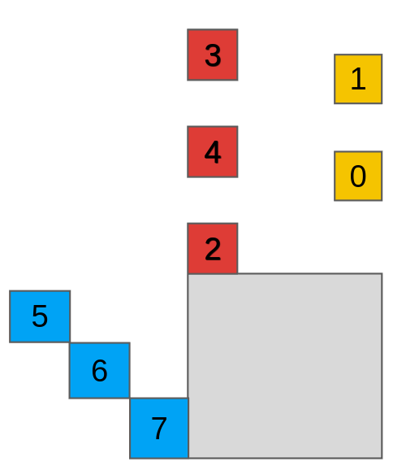
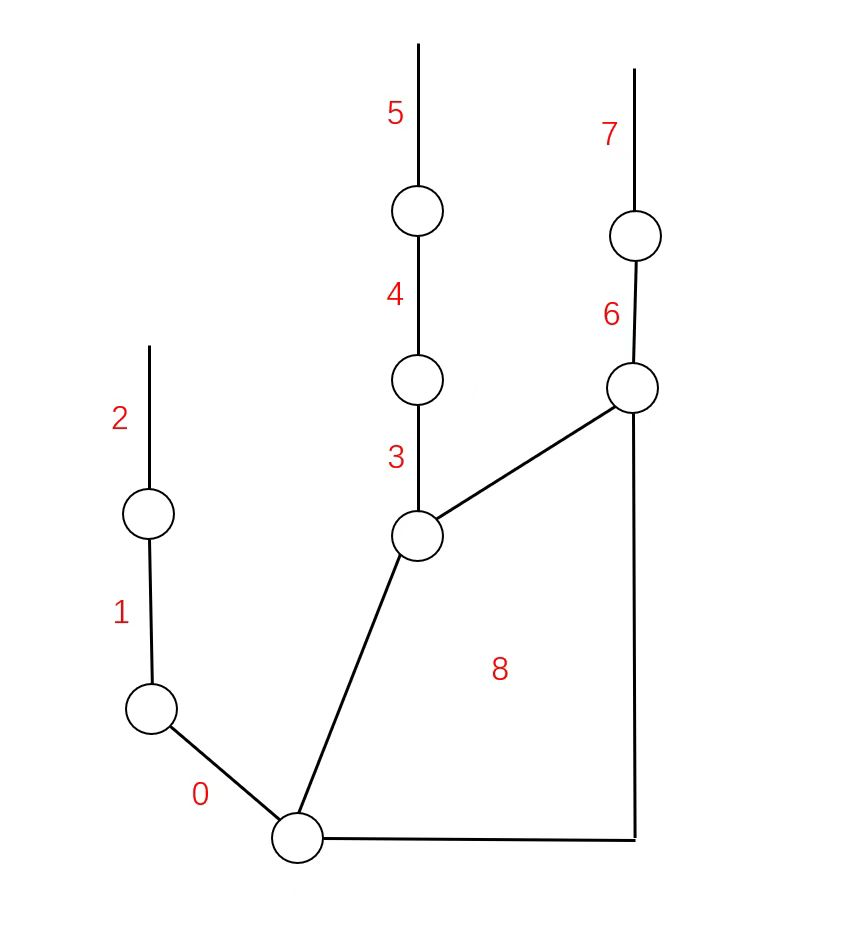
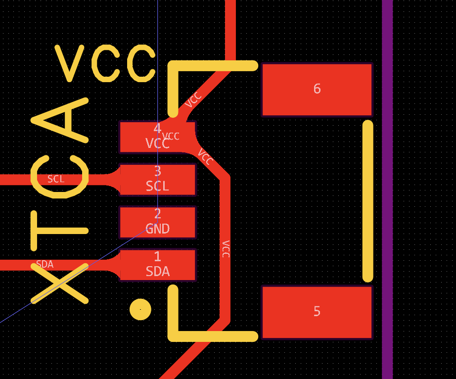

# Gripper Triple

## Finger joint index


## Exoskeleton index



# Operation Steps
0. Hardware wiring
    - The RDK X5 has I2C5 (physical pin numbers 3 and 5) and I2C0 (physical pin numbers 27 and 28) enabled by default on the 40PIN, with an IO voltage of 3.3V.
    - By default, **I2C0** is used (physical pin numbers **27** and **28**).
    - The sequence of the four pins on the string board is as shown in the figure, with the silkscreen marking **VCC**.
    
1. sunrise RDK x5 IP setting
    - The RDK's static IP is `192.168.127.10`, connected via wired connection.
    - Connect to Wi-Fi, it is recommended to use a mobile hotspot and ensure that only this Wi-Fi network is set to auto-connect. Subsequent power supply will allow for direct connection.
        - `sudo wifi_connect "YOUR WIFI NAME" "YOUR WIFI PASSWORD"`
        - **if not work** 
        ```bash
        sudo -i
        nmcli con add con-name "YOUR WIFI NAME" ifname wlan0 type wifi ssid "YOUR WIFI PASSWORD"
        nmcli --ask con mod "YOUR WIFI NAME" wifi-sec.key-mgmt wpa-psk wifi-sec.psk "YOUR WIFI PASSWORD"
        sudo wifi_connect "YOUR WIFI NAME" "YOUR WIFI PASSWORD
        ```
    - Acquire the dynamic IP address **host_IP** for wireless SSH connection.
2. Put files of **Gripper_Triple/sunrise_RDK_x5** in RDK
    - **Gripper_Triple/sunrise_RDK_x5/angle_publisher.py** is a ROS2 node of publishing topic "angles"
    `python angle_publisher.py`
3. Subscribe angels topic and visualize in Mujoco 
    - **Gripper_Triple/ROS_Connection**  is the main folder
    - **Gripper_Triple/ROS_Connection/mjcf** is the model file
    - `python Gripper_Triple/ROS_Connection/ROS2mujoco.py`
4. Details in ROS2mujoco.py
    - **zero_angles** is the zero calibration array